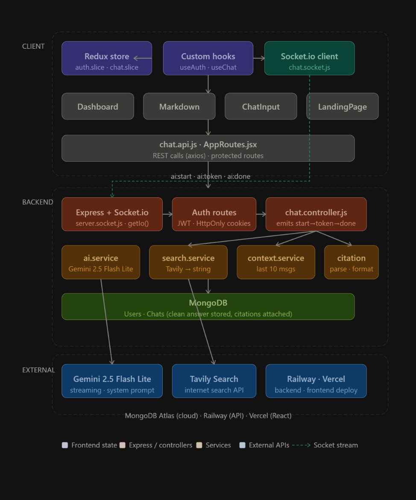

# Research-AI 🚀

Welcome to **Research-AI**! This is a full-stack, real-time chat application built using the powerful **MERN** stack (MongoDB, Express.js, React, Node.js) combined with modern tooling like Vite, TailwindCSS v4, and Socket.io for a seamless real-time experience.

---

## 📖 Table of Contents
- [Project Overview](#-project-overview)
- [Architecture](#-architecture)
- [Features](#-features)
- [Tech Stack](#-tech-stack)
- [Getting Started](#-getting-started)
- [Environment Configuration](#-environment-configuration)
- [Complete Project Workflow](#-complete-project-workflow)
- [AI Integration & Services](#-ai-integration--services)
- [Frontend-Backend Integration](#-frontend-backend-integration)
- [UI Component Architecture](#-ui-component-architecture)
- [API Endpoints](#-api-endpoints)
- [Project Architecture & Directory Structure](#-project-architecture--directory-structure)

---

## 🌟 Project Overview
Research-AI is designed to provide secure authentication alongside an interactive real-time chat interface. Users can seamlessly establish chat sessions, send/receive messages instantly using markdown, view their active chats, and securely manage their sessions.

## 🏗 Architecture


---

## ✨ Features
- **Real-time Chat**: Powered by Socket.io for instantaneous messaging.
- **AI-Powered Search**: Integrates Tavily Search for real-time internet-backed responses.
- **Smart Summarization**: Uses Mistral to generate concise chat titles.
- **Secure Auth**: JWT-based authentication with HttpOnly cookies.
- **Markdown Support**: Rich text formatting with code syntax highlighting.
- **Citations**: AI responses include clickable source links for transparency.
- **Email Verification**: OAuth2-based email verification using Nodemailer.

---

## 🛠 Tech Stack
**Frontend (Client)**
- React 19 (via **Vite**)
- **Redux Toolkit** (State Management & Data Fetching)
- **Tailwind CSS v4** (Modern Styling Setup)
- **React Router v7** (Routing & Application Flow)
- **Socket.io-Client** (Real-time seamless connection)
- **React Markdown** (Rich text formatting in chat responses)

**Backend (Server)**
- **Node.js** & **Express.js** (Core API Architecture)
- **MongoDB** with Mongoose (NoSQL Database)
- **Socket.io** (WebSockets for bi-directional live messaging)
- **JWT (JSON Web Tokens)** (Authentication via persistent HTTP-only Cookies)
 
---

## 🔑 Environment Configuration

Create a `.env` file in the `backend/` directory and populate it with the following:

```env
# Database
MONGO_URI=your_mongodb_uri

# Authentication
JWT_SECRET=your_jwt_secret

# AI API Keys
GEMINI_API_KEY=your_gemini_api_key
MISTRAL_API_KEY=your_mistral_api_key
TAVILY_API_KEY=your_tavily_api_key

# Email Service (Google OAuth2)
GOOGLE_USER=your_email@gmail.com
GOOGLE_CLIENT_ID=your_google_client_id
GOOGLE_CLIENT_SECRET=your_google_client_secret
GOOGLE_REFRESH_TOKEN=your_google_refresh_token
```

---

## 🔄 Complete Project Workflow

### 1. **Authentication Flow**
- **Registration**: Users easily create an account using `email`, `username`, and `password`. The system robustly validates these details, hashes the password, and provisions the user inside the database. It also offers email verification endpoints.
- **Login**: Upon registration verification, credentials can be formulated to securely login. The server validates credentials and issues a secure, HttpOnly JWT cookie ensuring safe future requests.
- **Session Persistence (`get-me`)**: Whenever the frontend finishes loading, it automatically fires the `get-me` endpoint. This validates the background cookie and restores the user session rapidly without the hassle of relogging.

### 2. **Real-Time Chat Workflow**
- **Connection**: Upon successive login/verification, a persistent, live Socket.io connection pipeline sits open between the individual client context and the centralized server socket.
- **Fetching Chats**: The React frontend initially connects to the centralized API (`/api/chat/`) to resolve previous user conversations and populates the sidebar respectively.
- **Messaging in Real-Time**: 
  - First, a user structurally writes a test or markdown-heavy message.
  - A structured API request (`POST /api/chat/message`) stores the message payload indefinitely within MongoDB.
  - Concurrently acting as a middleman, Socket.io actively broadcasts the live message data strictly to the applicable chat session allowing for visual representation across different logged-in connections matching the conversation.
- **Chat Management**: Users may load historical messages of particular threads via `/:chatId/messages` and are even provided capabilities to remove outdated discussions through the `delete` workflow.

---

## 🤖 AI Integration & Services

The backend architecture uses a modular approach to handle AI capabilities, splitting concerns across models, tools, agents, and services.

### 1. Model Initialization (`backend/src/ai/model.js`)
This module initializes our core AI and search instances using environment variables:
- **Gemini (`gemini-2.5-flash-lite`)**: Instantiated via `@langchain/google-genai`, acting as the primary conversational brain for complex reasoning and agentic tasks.
- **Mistral (`mistral-small-latest`)**: Instantiated via `@langchain/mistralai`, utilized efficiently for generating short, descriptive chat titles.
- **Tavily**: Instantiated via `@tavily/core`, providing the real-time internet search capability.

### 2. Search Tooling (`backend/src/ai/tools/internet.tool.js`)
- **`internetSearch`**: Relies on the Tavily API to execute real-time web queries, retrieving up to 5 maximum results.
- It formats the returned data into a readable string structure containing the Source, Title, URL, and a Summary for the AI to parse easily and cite properly.
- **`searchInternetTool`**: Wraps the `internetSearch` function into a formal Langchain `tool` with an explicit Zod schema (requiring a `query` string).

### 3. Langchain Agents (`backend/src/ai/agents/search.agent.js`)
- **`searchAgent`**: A dynamic agent created using `createAgent`, binding the `geminiModel` with the `searchInternetTool`. This allows Gemini to autonomously decide when to query the internet for up-to-date information.

### 4. Core AI Service (`backend/src/services/ai.service.js`)
This service acts as the bridge orchestrating AI interactions:
- **`generateResponse`**: Invokes `searchAgent.stream` with a highly detailed `System_Prompt` that enforces source-backed, structured responses with inline citations (e.g., `[1]`). It streams the AIMessage chunks directly back to the client.
- **`generateChatTitle`**: Passes the user's first message to `mistralModel` to generate a concise 2-4 word title.
- **Context Management**: `buildContext` truncates chat history to the last 10 messages to maintain efficiency and stay within token limits.
- **Citation Parsing & Formatting**: `parseCitations` and `formatResponse` extract URL footprints from the AI's response text and map them into structured `citations` objects for the frontend UI.

### 5. Controller Integration (`chat.controller.js`)
When a `POST` request to `/message` is fired, the AI interaction pipeline kicks in:
- The controller checks if a `chatId` was provided. If missing (meaning it's a new conversation), it triggers `generateChatTitle` and persists a new `chatModel` entry.
- **Persistent Conversational Memory**: The controller executes a database lookup inside `messageModel` fetching chronological chat history tied to the active `chatId`. 
- This historical context is forwarded directly into `generateResponse(messages)` resolving context seamlessly.

### 6. Database Memory Structure (`chat.model` & `message.model`)
For the real-time agent to maintain long-term contextual awareness, the conversations are persisted relationally:
- **`chat.model.js`**: Contains the root conversation instance referencing the `User` alongside the AI-generated `title`.
- **`message.model.js`**: Chronologically maps individual pieces of text to their parent `chat`. Crucially, it enforces a strict `role` enum (`"user"` or `"ai"`).
- Inside `ai.service.js`, the historical array from `messageModel` is converted into Langchain's conceptual formats (`HumanMessage` & `AIMessage`).

---

## 🔗 Frontend-Backend Integration Workflow
To guarantee a reactive and secure user interface, the React frontend handles server communication via structured API services, hooks, and global state reducers.

### 1. HTTP Client & Security (Axios)
- Both `auth.api.js` and `chat.api.js` use custom **Axios** instances with a `baseURL` pointing to the server.
- Every axios request establishes `withCredentials: true`, allowing the frontend to automatically transit the secure `HttpOnly` JWT Authentication Cookie.

### 2. Custom Hooks Orchestration (`useChat.js`)
- **`handleSendMessage`**: Dispatches user text to `chat.api.js`. It manages the optimistic UI updates via Redux (`addNewMessage`, `createNewChat`).
- **Real-Time Streaming**: Listens to Socket.io events (`ai:start`, `ai:token`, `ai:done`) to handle the streaming response from the AI, updating the `streamingText` state in real-time.
- **`handleGetChats` & `handleOpenChat`**: Fetch chat history and manage the active conversation state.

### 3. Redux Global State Centralization (`store` & `slices`)
- Any resolved API network response triggers dispatched structures to local UI states within `auth` and `chat` slices. Loaded `chats` map dynamically onto Redux memory for zero-latency switches.

### 4. Real-Time Persistent Socket (`chat.socket.js`)
- Leverages `socket.io-client` natively via `intializeSocketConnect`. It shares `withCredentials: true` rules, ensuring websockets are tied to verified HTTP identity tokens.

---

## 🎨 UI Component Architecture & Formatting
The `frontend/src/features/chat` module constructs an advanced interface combining complex React hooks with dynamic Markdown rendering.

### 1. `DashBoard.jsx` (The Core Layout)
- Central command component syncing `useChat` custom hooks with the Redux store.
- Provides loading animations ("Thinking dots") and handles `isStreaming` state for real-time AI response rendering.
- Manages scroll positions natively using `scrollIntoView()`.
- Isolates AI "Sources" into interactive citation bars.

### 2. `MarkdownComponents.jsx` (Sophisticated Parsing)
AI responses are rendered via `react-markdown` with `remarkGfm`.
- **Dynamic `<CodeBlock>`**: Intercepts `code` outputs, adding syntax headers and a "Copy" functionality.
- **Inline Web Citations**: A regex-based mechanism resolves AI's internal response footnotes (e.g., `[1]`), binding them to dynamically clickable inline footnotes.

### 3. `ChatInput.jsx` (Reactive Form Controls)
- Interactive `textarea` with auto-resizing logic (up to `120px` height).
- Intercepts physical keyboard `Enter` actions and prevents API racing conditions by disabling inputs during `isLoading` states.


---

## 🔌 API Endpoints
Endpoints are completely categorized, safeguarded, logging-enabled (via Morgan), and highly cohesive. A complete list revolves around:

### **Auth Endpoints** (`/api/auth`)
| Method | Endpoint | Description | Access | Payload/Parameters |
| ------ | -------- | ----------- | ------ | ------------------ |
| `POST` | `/register` | Validates inputs using Joi/Zod, hashes the password, creates a new user in MongoDB, and triggers a verification email. | Public | Body: `{ username, email, password }` |
| `POST` | `/login` | Authenticates user identity, compares password hash, and resolves with an `HttpOnly` JWT Cookie for secure session management. | Public | Body: `{ email, password }` |
| `GET`  | `/get-me` | Returns the currently logged-in user's profile details based on the valid JWT cookie. | Private | Headers: Cookie |
| `GET`  | `/verify-email` | Validates an email token and marks the user's account as verified in the database. | Public | Query: `?token=...` |

### **Chat Endpoints** (`/api/chat`)
| Method | Endpoint | Description | Access | Payload/Parameters |
| ------ | -------- | ----------- | ------ | ------------------ |
| `GET`  | `/` | Retrieves a list of all chat sessions associated with the authenticated user, sorted by recency. | Private | Headers: Cookie |
| `POST` | `/message` | Core AI interaction endpoint. Processes user messages, streams AI responses via Socket.io, saves message history, and auto-generates chat titles for new chats. | Private | Body: `{ text, chatId? }` |
| `GET`  | `/:chatId/messages` | Fetches the complete chronological message history for a specific chat session. | Private | Params: `chatId` |
| `DELETE`| `/delete/:chatId` | Completely removes a chat session and all its associated messages from the database. | Private | Params: `chatId` |

*(Note: Every `Private` scoped endpoint is strictly walled behind an `authUser` wrapper expecting validated JSON Web Tokens configured tightly in cookies!)*

---

## 🗂 Project Architecture & Directory Structure

```text
Research-AI/
│
├── backend/                      # Server-side environment & application logic
│   ├── src/
│   │   ├── ai/                   # AI model instances, tools, and agents
│   │   │   ├── agents/           # Langchain Agents logic
│   │   │   │   └── search.agent.js # Agent utilizing search tools
│   │   │   ├── tools/            # Specialized AI tools (Search, etc.)
│   │   │   │   └── internet.tool.js # Tavily Search implementation
│   │   │   └── model.js          # AI Models Initialization (Gemini, Mistral)
│   │   ├── config/               # Database and server configurations
│   │   │   ├── config.js         # Configuration setup
│   │   │   └── db.js             # Mongoose connection setup (MongoDB)
│   │   ├── controllers/          # Business logic handlers for specific routes
│   │   │   ├── auth.controller.js # Logic for user registration, login, and logout
│   │   │   └── chat.controller.js # Logic for handling chats and AI responses
│   │   ├── middlewares/          # Security and request interceptors
│   │   │   └── auth.middleware.js # Middleware to verify JWT tokens in cookies
│   │   ├── models/               # MongoDB schema definitions using Mongoose
│   │   │   ├── chat.model.js     # Schema for conversation metadata
│   │   │   ├── message.model.js  # Schema for individual chat messages
│   │   │   └── user.model.js     # Schema for user profiles and credentials
│   │   ├── routes/               # API endpoint definitions mapping to controllers
│   │   │   ├── auth.routes.js    # Routes for auth-related actions
│   │   │   └── chat.routes.js    # Routes for chat and message management
│   │   ├── services/             # Specialized logic and external integrations
│   │   │   ├── ai.service.js     # Core AI logic (Gemini & Mistral integration)
│   │   │   └── mail.service.js   # Email dispatch logic for verification
│   │   ├── socket/               # Real-time communication processors
│   │   │   └── server.socket.js  # Backend Socket.io event listeners
│   │   ├── validators/           # Request body validation and sanitization
│   │   │   └── auth.validator.js # Joi/Zod validators for auth inputs
│   │   └── app.js                # Main Express application configuration
│   ├── package.json              # Backend dependencies and execution scripts
│   ├── server.js                 # Entry point for the server and socket mounting
│   └── .env                      # Environment secrets (MongoDB, API Keys, JWT)
│
└── frontend/                     # Client-Side Application (React + Vite)
    ├── public/                   # Static assets accessible globally
    │   └── vite.svg              # Vite branding asset
    ├── src/
    │   ├── APP/                  # Global application-level logic & styling
    │   │   ├── routes/
    │   │   │   └── AppRoutes.jsx # Navigation routing (Public vs Protected)
    │   │   ├── store/
    │   │   │   └── App.store.js  # Centralized Redux store setup
    │   │   ├── App.jsx           # Root UI Layout component
    │   │   └── index.css         # Global CSS & Tailwind directives
    │   ├── features/             # Scalable feature-based directory pattern
    │   │   ├── auth/             # Authentication & User Management
    │   │   │   ├── components/
    │   │   │   │   └── Protected.jsx # Authorization wrapper for routes
    │   │   │   ├── hooks/
    │   │   │   │   └── useAuth.js   # Hook for calling registration/login
    │   │   │   ├── pages/
    │   │   │   │   ├── Login.jsx    # User Login page interface
    │   │   │   │   └── Register.jsx # Account creation page interface
    │   │   │   ├── services/
    │   │   │   │   └── auth.api.js  # Axios endpoints for Auth API
    │   │   │   └── slice/
    │   │   │       └── auth.slice.js # Global Auth state (User, Status)
    │   │   └── chat/             # Interactive Assistant & Real-time Chat
    │   │       ├── components/
    │   │       │   ├── ChatInput.jsx # Interactive message composition field
    │   │       │   ├── MarkdownComponents.jsx # Rich rendering for AI responses
    │   │       │   ├── Navbar.jsx    # Application top navigation menu
    │   │       │   ├── Reuse.jsx     # Collection of reusable UI elements
    │   │       │   └── Sidebar.jsx   # List of active conversations/history
    │   │       ├── hooks/
    │   │       │   └── useChat.js    # logic for AI response & Socket flow
    │   │       ├── pages/
    │   │       │   ├── DashBoard.jsx # The main primary chat dashboard
    │   │       │   ├── Landing.jsx   # Project Overview & Welcome page
    │   │       │   └── Profile.jsx   # User identity & security settings
    │   │       ├── services/
    │   │       │   ├── chat.api.js   # Axios endpoints for Chat/History API
    │   │       │   └── chat.socket.js # Client-side Socket.io initialization
    │   │       ├── shared/
    │   │       │   ├── global.js     # Shared UI constants & helper functions
    │   │       │   └── LogoIcon.jsx  # Scalable logo component
    │   │       ├── slices/
    │   │       │   └── chat.slices.js # Global Chat state (Messages, Threads)
    │   │       └── styles/
    │   │           ├── landing.css   # Styles specifically for Landing page
    │   │           └── navbar.css    # Styles specifically for Navbar
    │   └── main.jsx                  # Main React mount point and entry script
    ├── eslint.config.js          # ESLint rules for code quality
    ├── index.html                # Root HTML template for the SPA
    ├── package.json              # Frontend dependencies (React, Redux, etc.)
    └── vite.config.js            # Vite bundler configuration and proxying
```

---

## 🤝 Contributing
Contributions are welcome! Please follow these steps:
1. Fork the project.
2. Create your feature branch (`git checkout -b feature/AmazingFeature`).
3. Commit your changes (`git commit -m 'Add some AmazingFeature'`).
4. Push to the branch (`git push origin feature/AmazingFeature`).
5. Open a Pull Request.

---

## 📜 License
Distributed under the MIT License. See `LICENSE` for more information.

---

## 📧 Contact
Ghansham Jadhav - [ghanshamjadhav204@gmail.com](mailto:ghanshamjadhav204@gmail.com)

Project Link: [https://github.com/sham-jadhav03/Research-AI](https://github.com/sham-jadhav03/Research-AI)
